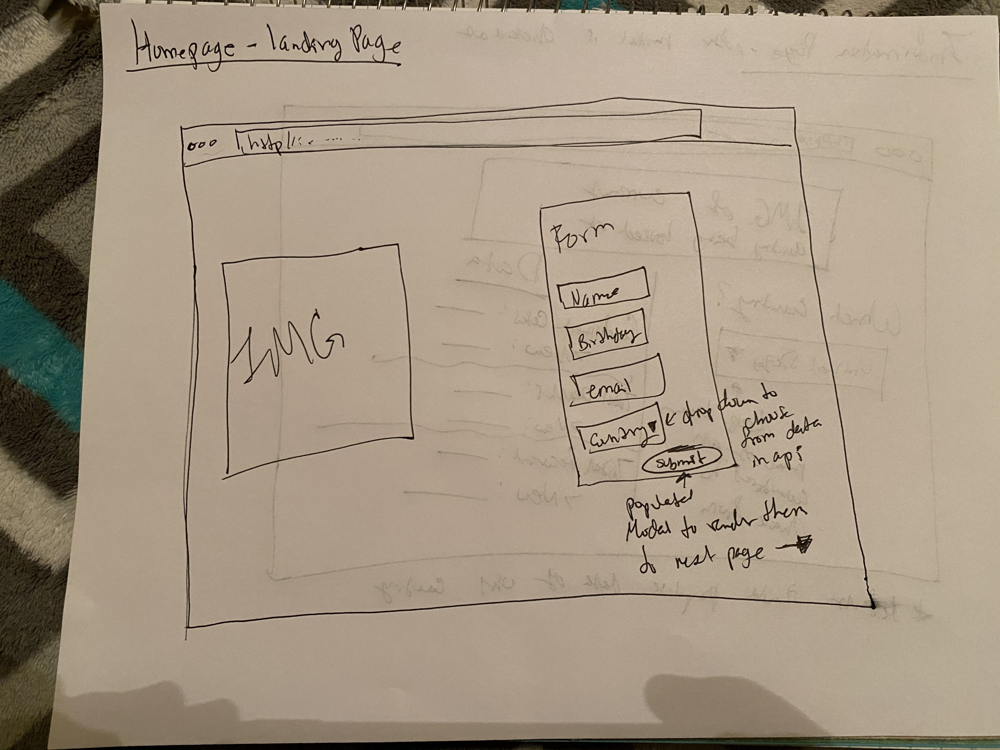
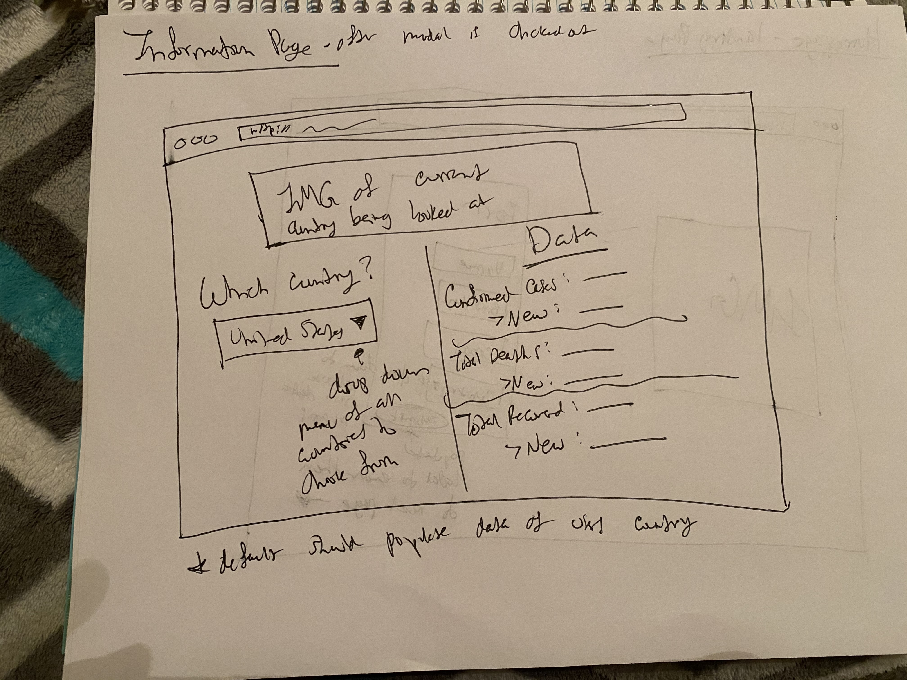

# Covid-Tracker
React project (given 04/21 due 04/24)

## Minimum Requirements 
Project must be approved by Instructor approval at the start of project week

Project code is pushed to a public Git repository

The code should be written in ES6 as much as possible

Use the create-react-app generator to start your project. - Completed 

There should be 2 container components (stateful)

There should be 5 presentational components (stateless)

There should be 3 or more routes

The application must make use of react-router

Make use of async actions to send data to and receive data from a server

Your client-side application should handle the display of data with minimal data manipulation

Uses CSS or styled components to style application

Frontend uses Axios requests 

App renders in browser

On project submission there should be 0 console.log() statements seen in the browser

Be written with kebab-case CSS class names (e.g. this-is-the-class-name) //simply replacing spaces with dashes; resource(s): https://medium.com/better-programming/string-case-styles-camel-pascal-snake-and-kebab-case-981407998841

Be written with semantic, camelCase JavaScript variable names
pseudocode file in root of project repository

Has readme.md file at the root of repository - Completed 

readme file clearly documents the purpose of the project as a problem statement - Completed

readme file clearly documents the target end user for this program. - Completed 

readme file has embedded link (not url) to publicly deployed app - Completed 

Using a 3rd party api - Completed

## Propsal: COVID-19 info tracker 

#### API being used: 

https://api.covid19api.com/summary (found from google. https://covid19api.com/#details )
> Has global and breaks down by country as well. 

#### Problem statement (what are you solving with this app?)

This app will solve in ensuring people are up-to-date by country they search (solving to make it easier for users to find current numbers in cases)

#### Target Users (audience?)

Anyone with access to internet who wants to see recent data regarding the virus. 

#### WireFrame 

2 stateful (class components)
>Form to input their name, birthday, email, and home country/rendered to information searching page

>Parent class with state of different info that can be pulled from api:  Global object or to go by Countries array with nested objects w/ Country, CountryCode, Slug, NewConfirmed, TotalConfirmed, NewDeaths, TotalDeaths, NewRecovered, TotalRecovered, and Date.

5 functional/stateless (Presentational component)
>button onSubmit function for submitting form on homepage and renders a modal thanking them and clicking the X to clear modal renders them to information page 

>modal for first bullet point 

>function that pulls data no matter what country is being searched; should contain/show the same information of Country with NewConfirmed, TotalConfirmed, NewDeaths, TotalDeaths, NewRecovered, and TotalRecovered.

>function that populates this data cleanly to user 

> function that populates image of current country that user is currently looking up in information page

